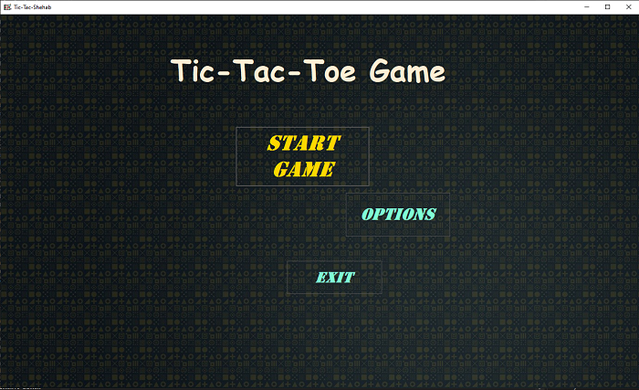
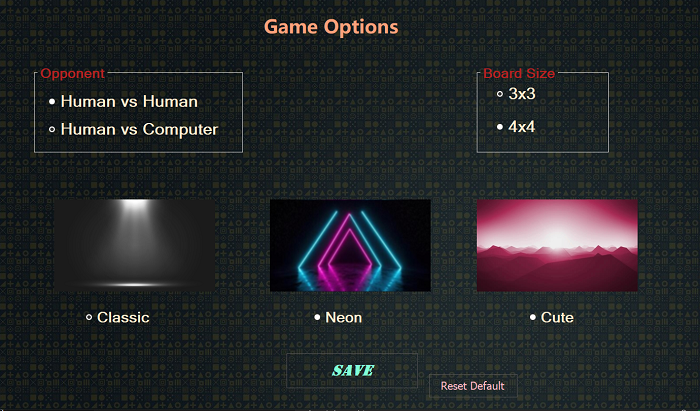
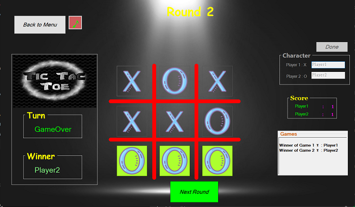
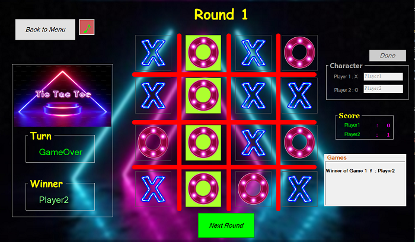

# TicTacToe-CSharp-WinForms

**Date Created:** October 2025

## Overview  
This is a Windows Forms implementation of the classic Tic-Tac-Toe (XO) game developed in C#.  
The project demonstrates the use of object-oriented programming (OOP) concepts, Windows Forms UI design, and basic game logic implementation.

## Features  
- Play against another human or the computer.  
- Supports 3x3 and 4x4 board sizes.  
- Multiple visual themes for the game board.  
- Score tracking and round system.  
- Background music and sound effects integrated using NAudio.  
- Simple and intuitive user interface.

## Technologies  
- C# with .NET Framework  
- Windows Forms  
- NAudio library for audio playback  
- Visual Studio Solution structure

## Project Folders  
- `Properties/` - Project settings and resources.  
- `Resources/` - Images and other resources used in the game.  
- `Sounds/` - Background music and sound effects.  

## Usage  
1. Clone or download the repository.  
2. Open the solution file `TicTacToe-CSharp-WinForms.sln` in Visual Studio.  
3. Restore NuGet packages if prompted.  
4. Build and run the project.  
5. Choose game options, start the game, and play.

## Music
Background music: "Gymnopédie No. 1" by Erik Satie (public domain)

## Notes  
- The computer opponent plays randomly and does not implement advanced AI strategies.  
- The project focuses on demonstrating OOP and Windows Forms capabilities rather than creating a highly competitive AI.  

## Screenshots:
------------

Main Menu:

Options:

Gameplay Classic 3x3:

Gameplay Neon 4x4:

